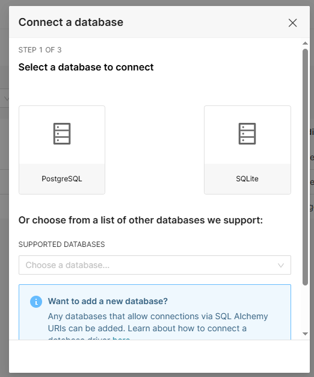
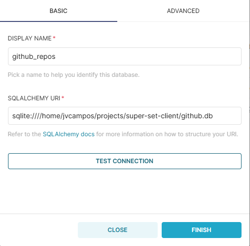

# sample-superset

Este projeto contém a configuração de ambiente e os comandos iniciais para rodar o **Apache Superset** em ambiente de desenvolvimento local.

# 📊 O que é o Apache Superset?

O **Apache Superset** é uma **plataforma moderna de exploração e visualização de dados** desenvolvida pela comunidade Apache. Ele permite criar dashboards interativos, gráficos, tabelas e consultas SQL de forma rápida e intuitiva, sem a necessidade de escrever muito código.

---

## 🚀 Principais Recursos

- **Interface amigável** para criação de dashboards
- Suporte a **diversas fontes de dados** (PostgreSQL, MySQL, Snowflake, BigQuery, etc.)
- Editor SQL com **autocompletar e salvamento de consultas**
- Controle de acesso com **gestão de usuários e permissões**
- Suporte a **plugins e personalizações**
- Código aberto e mantido pela **Apache Software Foundation**

---

## 📦 Requisitos

Antes de começar, certifique-se de ter instalado:

- Python 3.8+
- pip
- virtualenv (ou `venv`)
- Node.js e npm (opcional, caso vá customizar o frontend)
- Redis e PostgreSQL (dependências do Superset)

---

## Passo a passo

### **1 -** Criação do ambiente

**1.1** Clone esse repositório e execute o script para inicialização do ambiente e instalação das dependências necessárias:

```bash
git clone https://github.com/vitorluzz/superset-sample.git
cd superset-sample
chmod +x setup.sh
chmod +x start-superset.sh
./setup.sh
```

**1.2** Adicione essas variáveis de ambiente ao bashrc:
```bash
# SUPERSET
export SUPERSET_SECRET_KEY=1qaz2wsx
export FLASK_APP=superset
```

**1.3** Atualize o seu bashrc:
```bash
source ~/.bashrc
```

### **2 -** Criação do Usuário de Acesso

Crie o seu usuário de acesso à plataforma:
```bash
superset fab create-admin
```

### **3 -** Inicialização do Superset

Execute o script para inicializar o Apache SuperSet: 
```bash
./start-superset.sh
```

### **4 -** Conexão com o banco de dados SQLite

**4.1** Em 'Settings', vá em 'Database Connections', e clique em '+ DATABASE', vamos configurar uma conexão.

**4.2** Selecione a opção 'SQLite':



**4.3** Dê um nome a essa conexão e adicione o caminho ao banco de dados desse repositório:

Exemplo do caminho:
```bash
sqlite:////home/jvcampos/projects/superset-sample/github.db
# sqlite:////home/seu_usuario/diretorio_de_projetos/superset-sample/github.db
```




> E pronto, você terá um Apache Superset funcionando com um banco de dados de repositórios do github conectado.
